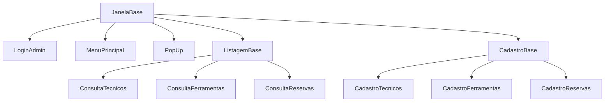
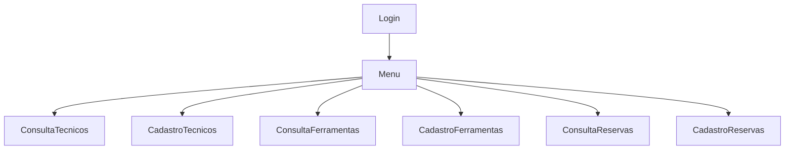

# Aplicação "Central de Ferramentaria"

## Informações Gerais

- **Curso:** Desenvolvimento Full Stack
- **Missão Certificação:** Mundo 1
- **Semestre Letivo:** 2022.2
- **Grupo:** DEVTEAM 7

## Equipe

- Alessandro Thury de Oliveira
- Fernando Rocha Fonteles Filho - Matrícula: 2022 0450 1864
- Gilson Miranda Neto - Matrícula: 2022 0443 7562
- Julio Cesar Navagantes Gouveia
- Mariana Lucas Fernandes Onorio - Matrícula: 2022 0446 5469

## Objetivos

Desenvolver uma aplicação para gerenciamento de ferramentas em um ambiente de produção de conteúdo audiovisual de grande
porte.

## Contextualização e processo

- Diferentes equipamentos com diversas necessidades de manutenção
- Equipes de manutenção trabalham em turnos
- Necessidades de diversas ferramentas específicas e com valores elevados
- Ferramentas precisam estar em bom estado de conservação e aferidas de acordo com as normas e padrões do fabricantes
- Ferramentas com diversas características técnicas que indicam para qual uso específico elas se aplicam
- A correta reserva da ferramenta antes da execução do trabalho é fator crítico de sucesso
- Local onde as ferramentas ficam armazenadas chama-se "Central de Ferramentaria"
- As ferramentas precisam ser reservadas com, no mínimo, 24 horas de antecedência
- Solicitação de reserva são enviadas por por e-mail para o responsável pela Central
- No momento da reserva deve-se informar: Data e Hora da Retirada e da Devolução
- Reservas precisam ficar associadas ao técnico responsável pela sua retirada
- Uma ferramenta só pode ser reservada se ela estiver disponível na data e hora da retirada, ou seja, não pode estar
  reservada por outro técnico no momento da retirada
- O responsável pela central controla as devoluções de forma a garantir que as ferramentas estarão sempre disponíveis no
  momento previsto para a próxima retirada

## Entregas

### Entregas obrigatórias

- Cadastro de ferramentas ✅
- Cadastro de técnicos ✅
- Consulta as ferramentas cadastradas ✅
- Consulta dos técnicos cadastrados ✅

### Entregas bonus

- Cadastro de reserva de ferramenta ✅
- Consulta de reservas de ferramentas ✅
- Impressão das reservas de ferramentas ✅

---

### Módulos utilizados

- tkinter
- csv
- FPDF
- tkcalendar
- datetime
- subprocess
- os
- platform

### Como rodar a aplicação

- Instale todos os modulos citados acima.
- Rode o arquivo main.py.
- Na tela de login, utilize as seguintes credenciais:
    - email: admin@estacio.br
    - senha: mundo1grupo7
- Você será redirecionado ao Menu Principal, onde terá acesso:
    - Listar Técnicos
    - Cadastrar Técnicos
    - Listar Ferramentas
    - Cadastrar Ferramentas
    - Listar Reservas
    - Cadastrar Reservas
- Nas telas de listagens:
    - Gere um relatório clicando no botão "Gerar Relatório"
    - Altere ou exclua um cadastro selecionando a linha desejada, dois novos botões irão aparecer na parte inferior da
      tela.
- Nas telas de cadastro:
    - As validações dos campos são feitas ao clicar no botão "Cadastrar" ou "Alterar", caso esteja editando um cadastro.

---

## Objetos principais

### :construction_worker: Tecnico

- Atributos

> - id_cpf -> cpf do técnico
> - nome -> primeiro nome do técnico
> - sobrenome -> sobrenome do técnico
> - telefone -> telefone do técnico com DDD e sem parenteses
> - turno -> poderá ser: Integral, Manhã, Tarde ou Noite
> - equipe -> poderá ser: Alfa α, Beta β, Gama γ ou Delta δ

### :hammer: Ferramenta

- Atributos

> - id_ferramenta -> número identificador da ferramenta
> - modelo -> modelo/nome da ferramenta
> - descricao -> descrição da ferramenta
> - fabricante -> nome do fabricante da ferramenta
> - voltagem -> voltagens disponíveis: 110v, 127v, 220v, 380v, Baterias, N/A (não aplicável)
> - peso_g -> peso em gramas da ferramenta
> - tipo -> tipos disponíveis: Cabeamento, Caixa de som, Camera fotográfica, Computador, Gravador de som, Gravador de
    vídeo, Iluminação, Microfone, Monitor/Tela, Montagem/Construção, Placa de som, Placa de vídeo, Projetor, Outros
> - quantidade -> quantidade disponível para locação

### :page_with_curl: Reserva de Ferramenta

- Atributos

> - id_reserva -> número identificador da reserva
> - id_ferramenta -> número identificador da ferramenta + modelo e fabricante
> - id_tecnico -> número identificador do técnico + nome e sobrenome
> - data_retirada -> data da retirada
> - data_devolucao -> data da entrega prevista
> - status -> pode ser: **Em andamento**: a reserva se encontra entre a data de retirada e a data de entrega | **Em
    atraso**: a reserva se encontra após a data de entrega | **Concluído**: a reserva foi finalizada e a ferramenta foi
    devolvida

## Diagrama de classes

## Telas de navegação

- Login
- Menu principal
- Consulta de tecnicos (lista)
  -- Poderá editar e excluir cadastro de técnicos
- Consulta de ferramentas (lista)
  -- Poderá editar e excluir cadastro de ferramentas
- Consulta de reservas (lista)
  -- Poderá editar e excluir cadastro de reservas | Poderá gerar lista de reservas em formato pdf
- Cadastro de técnico (formulário)
- Cadastro de ferramentas (formulário)
- Cadastro de reservas (formulário)

---

# Levantamento de Requisitos

| Requisito                     | Descrição                                                                                                                                                                                                                                                   |
| ----------------------------- | :---------------------------------------------------------------------------------------------------------------------------------------------------------------------------------------------------------------------------------------------------------- |
| Cadastro de tecnicos          | O sistema deve permitir que o administrador cadastre novos técnicos com os seguintes atributos: **
CPF, Nome, Sobrenome, Telefone, Turno, Equipe**.                                                                     |
| Cadastro de ferramentas       | O sistema deve permitir que o administrador cadastre novas ferramentas com os seguintes atributos: **

ID, Modelo, Fabricante, Descrição, Voltagem, Peso em gramas, Tipo, Quantidade
disponível**. |
| Cadastro de reservas | O sistema deve permitir que o administrador cadastre novas reservas com os seguintes
atributos: **
ID, ID da ferramenta, ID do técnico, Data da retirada, Data prevista da devolução, Situação da
reserva**. |
| Consultar tecnicos | O administrador deve ter acesso a lista de tecnicos cadastrados no sistema. |
| Consultar ferramentas | O administrador deve ter acesso a lista de ferramentas cadastradas no sistema. |
| Consultar reservas | O administrador deve ter acesso a lista de reservas cadastradas no sistema. |
| Menu | O sistema deve ter um menu com as opções: **Consultar tecnicos, Cadastrar técnico,
Consultar ferramentas, Cadastrar ferramenta, Consultar reservas, Cadastrar
reservas.**
|
| Impressão de reserva | O sistema deve permitir a impressão da lista de reservas. |
