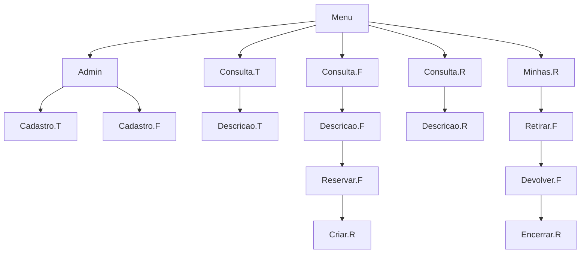

# Aplicação "Central de Ferramentaria"

## Equipe
- Alessandro Thury de Oliveira
- Fernando Rocha Fonteles Filho
- Gilson Miranda Neto
- Julio Cesar Navagantes Gouveia
- Mariana Lucas Fernandes Onorio

## Objetivos
Desenvolver uma aplicação para gerenciamento de ferramentas em um ambiente de produção de conteúdo audiovisual de grande porte.

## Contextualização e processo
- Diferentes equipamentos com diversas necessidades de manutenção
- Equipes de manutenção trabalham em turnos
- Necessidades de diversas ferramentas específicas e com valores elevados
- Ferramentas precisam estar em bom estado de conservação e aferidas de acordo com as normas e padrões do fabricantes
- Ferramentas com diversas características técnicas que indicam para qual uso específico elas se aplicam
- A correta reserva da ferramenta antes da execução do trabalho é fator crítico de sucesso
- Local onde as ferramentas ficam armazenadas chama-se "Central de Ferramentaria"
- As ferramentas precisam ser reservadas com, no mínimo, 24 horas de antecedência
- Solicitação de reserva são enviadas por por e-mail para o responsável pela Central
- No momento da reserva deve-se informar: Data e Hora da Retirada e da Devolução
- Reservas precisam ficar associadas ao técnico responsável pela sua retirada
- Uma ferramenta só pode ser reservada se ela estiver disponível na data e hora da retirada, ou seja, não pode estar reservada por outro técnico no momento da retirada
- O responsável pela central controla as devoluções de forma a garantir que as ferramentas estarão sempre disponíveis no momento previsto para a próxima retirada

## Entregas

### Entregas obrigatórias

- Cadastro de ferramentas
- Cadastro de técnicos
- Consulta as ferramentas cadastradas
- Consulta dos técnicos cadastrados

### Entregas bonus

- Cadastro de reserva de ferramenta
- Consulta de reservas de ferramentas
- Impressão das reservas de ferramentas

---

# Objetos e Telas

## Objetos

### :construction_worker: Tecnico

- Atributos

> - id_cpf : int
> - nome : string
> - sobrenome : string
> - telefone : int
> - turno : string
> - equipe : string

- Estados
> - admin : boolean

### :hammer: Ferramenta

- Atributos
> - id : int
> - modelo : string
> - descricao : string
> - fabricante : int
> - voltagem : int
> - peso_g : int
> - tipo : string
> - material : string
> - quantidade : int

- Estados
> disponivel : boolean

### :page_with_curl: Reserva de Ferramenta

- Atributos
> - id : int
> - data_reserva : time
> - data_retirada : time
> - data_devolucao : time
> - responsavel : tecnico
> - item : ferramenta

- Estados
> - emAndamento : boolean

## Telas de navegação

- Menu principal
- Consulta de tecnicos (lista)
-- Descrição/perfil do tecnico
- Consulta de ferramentas (lista)
-- Descricao da ferramenta -> Reservar ferramenta -> Criar/abrir reserva
- Consulta de reservas (lista)
-- Descrição da reserva
- Minhas Reservas
-- Retirar ferramenta -> Devolver ferramenta -> Fechar reserva
- Cadastro de tecnicos (admin only)
- Cadastro de ferramentas (admin only)

> T = Tecnico | F = Ferramenta | R = Reserva

---

# Levantamento de Requisitos

## Requisitos Funcionais

| Requisito | Descrição |
| - |:- |
| Cadastro de tecnicos | O sistema deve permitir que o usuário com cargo de **Administrador** cadastre novos técnicos com os seguintes atributos: **CPF, Senha, Nome, Sobrenome, CPF, Telefone, Turno, Equipe**. |
| Cadastro de ferramentas  | O sistema deve permitir que o usuário com cargo de **Administrador** cadastre novas ferramentas com os seguintes atributos: **ID, Modelo, Fabricante, Descrição, Part_Number, Tamanho, Tipo, Material**. |
| Consultar tecnicos | O usuario deve ter acesso a lista de tecnicos cadastrados no sistema.  |
| Consultar ferramentas | O usuario deve ter acesso a lista de ferramentas cadastradas no sistema.  |
| Menu  | O sistema deve ter um menu com as opções: **Consultar tecnicos, Consultar ferramentas, Consultar reservas, Minhas reservas.** |
| Menu Admin  | O menu do usuario Administrador deve ter as seguintes opções adicionais: **Cadastrar tecnico, Cadastrar ferramenta.**  |
| Reservar ferramenta | Se disponivel, o usuario pode reservar uma ferramenta atraves da pagina de descrição da ferramenta. O usuário terá que inserir a hora/data da retirada e da devolução. Obs.: o horario da reserva deve ser no minimo 24 horas antes do horario da retirada. |
| Geração da reserva  | Apos a confirmação da reserva de ferramenta, deve ser gerado um cadastro de reserva de ferramenta. Atributos: **id, data_reserva, data_retirada, data_devolucao, responsavel, item.** |
| Disponibilidade da ferramenta | O sistema deve alterar o status da ferramenta para indisponivel durante a hora da retirada até a hora da devolução. |
| Impressão de reserva | O sistema deve permitir a impressão de reservas. |

